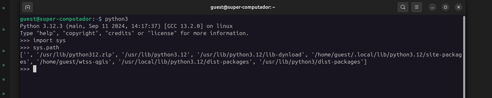
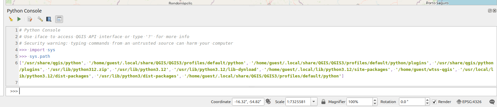
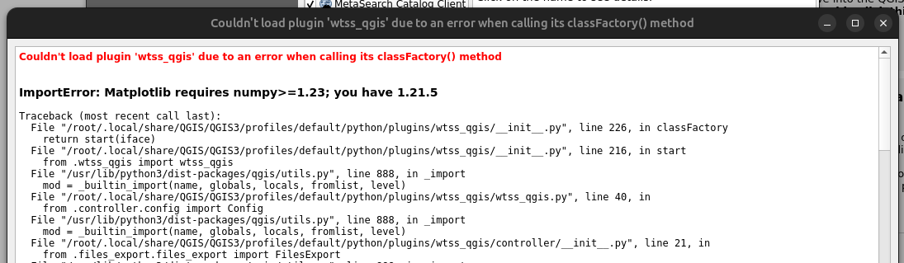

..
    This file is part of Python QGIS Plugin for WTSS.
    Copyright (C) 2024 INPE.

    This program is free software: you can redistribute it and/or modify
    it under the terms of the GNU General Public License as published by
    the Free Software Foundation, either version 3 of the License, or
    (at your option) any later version.

    This program is distributed in the hope that it will be useful,
    but WITHOUT ANY WARRANTY; without even the implied warranty of
    MERCHANTABILITY or FITNESS FOR A PARTICULAR PURPOSE. See the
    GNU General Public License for more details.

    You should have received a copy of the GNU General Public License
    along with this program. If not, see <https://www.gnu.org/licenses/gpl-3.0.html>.

==========================
Frequently Asked Questions
==========================

How to check python path?
-------------------------

Usually python home has the priority. To fix this error it is required to use command line python in your terminal or CMD.

Before make any configuration, check if your command line python has the same path of your installed QGIS, to do so go to terminal, and after start python console in QGIS, run this command lines in each them and compare the results:

.. code-block:: python

    import sys
    sys.path

The most common way to check your python environemnt is running `sys.path`.

.. note::

    Some issues in Windows environment are related to QGIS and its `Python` installed path.

    The Python IDLE in QGIS may raise this type of errors:

    .. code-block:: text

        Traceback (most recent call last):
            File "<stdin>", line 1, in <module>
        ModuleNotFoundError: No module named 'gdal'

    To solve this errors, add Python to the environmental variables in QGIS (`Settings >> Options >> System >> Environment`).

    The python home and path are usually like this (Using the Python 3.12):

    .. code-block:: text

        PYTHONHOME => C:\OSGeo4W\apps\Python312
        PYTHONPATH => C:\OSGeo4W\apps\qgis\python

Install dependencies using `requirements.txt`
---------------------------------------------

Another way to install the dependencies for plugin is to run the `pip install` using `requirements.txt`.

In this way, you need to locate the plugin installed path, generally in `C:\Users\%USER%\AppData\Roaming\QGIS\QGIS%QGIS_VERSION%\profiles\default\python\plugins` for Windows and ` /home/${USER}/.local/share/QGIS/QGIS3/profiles/default/python/plugins` for Linux.

.. code-block:: python

    pip install -r requirements.txt

.. note::

    For Windows users you need to start the `OSGeo4W Shell Software <https://www.osgeo.org/projects/osgeo4w/>`_ to run these commands.

How to fix packages conflicts?
------------------------------

The most common errors related to plugin installation are related to versions conflict of python libraries.

The installed version of `numpy <https://numpy.org/>`_ generally causes versions conflict like example below.

This errors is because the plugin install a version of ``numpy`` in a local path, but you have another version in global python home.

If your command line python is using the same of your installed QGIS, you can fix the version of ``matplotlib`` and ``numpy``.

The required versions for WTSS Plugin 0.4 is ``numpy !=1.24.0, <2, >=1.23`` and ``matplotlib >= 3.7``.

You can force the reinstall of ``numpy`` using equals (==) to fix the version:

.. code-block:: shell

    python3 -m pip install numpy==1.26 --force-reinstall

The same may be done for ``matplotlib``:

.. code-block:: shell

    python3 -m pip install matplotlib==3.7 --force-reinstall

.. note::

    Remember that QGIS must be restarted to load updates in python home.

.. note::

    - Sometimes it is necessary to upgrade pip with ``pip install --upgrade pip``;
    - If you get some access error, it is required to add ``--break-system-packages`` to fix the conflicts;

Can I install plugin using pip?
-------------------------------

The plugin dependencies can be installed using pip via command line.

If you have more espertise in programming, check the `Development Installation <./dev_install.html>`_

The plugin dependencies can be installed using this command:

.. code-block:: shell

    python3 -m pip install git+https://github.com/brazil-data-cube/wtss-qgis.git@v0.6.0

Another way is cloning the repository from ``github`` and run ``pip``:

.. code-block:: shell

    git clone https://github.com/brazil-data-cube/wtss-qgis.git@v0.6.0

.. code-block:: shell

    python3 -m pip install -e .[all]
