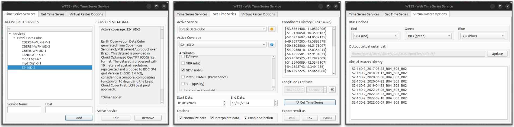
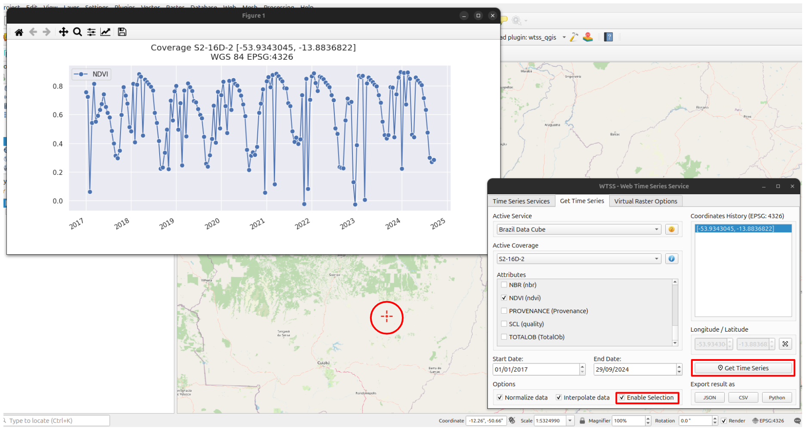
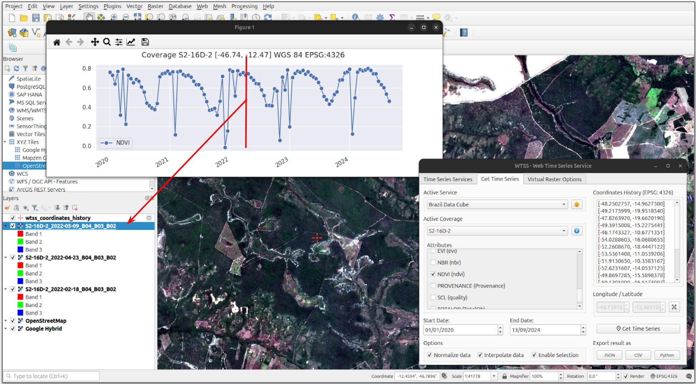

..
    This file is part of Python QGIS Plugin for WTSS.
    Copyright (C) 2024 INPE.

    This program is free software: you can redistribute it and/or modify
    it under the terms of the GNU General Public License as published by
    the Free Software Foundation, either version 3 of the License, or
    (at your option) any later version.

    This program is distributed in the hope that it will be useful,
    but WITHOUT ANY WARRANTY; without even the implied warranty of
    MERCHANTABILITY or FITNESS FOR A PARTICULAR PURPOSE. See the
    GNU General Public License for more details.

    You should have received a copy of the GNU General Public License
    along with this program. If not, see <https://www.gnu.org/licenses/gpl-3.0.html>.

====================
WTSS Plugin Overview
====================

The figure below presents the overview of the plugin, with the methodology based on the operations of the WTSS service. There are three sets of tools separated into sections: the first to view the active WTSS servers and the list of cubes and collections for each one, the second to retrieve and export the time series, and the last to configure the composition of the virtual rasters generation.

The first section refers to the WTSS list_coverages and describe_coverages operation, where the user can get an overview of the active time series servers and their respective image cube lists. The main server defined by default is `https://data.inpe.br/bdc/wtss <https://data.inpe.br/bdc/wtss>`_, but more servers can be added if the user wishes. Once the server is configured, the list of cubes is available, the plugin describes the data cube based on the selection in this list, providing important information about the geographical extent of the cube and how it was generated.

The second section refers to the time_series operation, where the user can retrieve the time series using the selection of attributes such as the server, the cube and the spectral bands and indices. With these attributes selected, it is necessary to obtain a coordinate, which the user can enter manually or select from a project canvas in QGIS. The coordinates used by the BDC project tools follow the ``EPSG: 4326`` coordinate system, which uses the `datum` WGS 84 (World Geodetic System 1984).

The third section of the plugin refers to the configuration for generating these virtual rasters, where you can define the RGB composition of the image and define where the image will be saved on the machine.This screen also has a history of the virtual rasters generated during the session.

===============================
Retrieve and Export Time Series
===============================

You can open the WTSS Plugin in ``Web`` tab. You must select an active ``WTSS server`` that you want to use. And choose the parameters for active ``coverages`` to retrieve the time series information. You must select the available ``bands`` and set a ``start`` and ``end date`` for coverage filter. Finally click on map and ``Get Time Series`` to get a ``latitude`` and ``longitude`` in vector layer with mouse.

After that, ``Time Series Plot`` will be displayed in new screen with the selected parameters:

The plugin will make a request to WTSS and return the graph with the time series. On this screen there are options to export the time series in JSON and CSV format, as well as exporting a code example in Python to retrieve and obtain the same graph with the selected attributes. All the coordinates searched are stored in a history in case the user wants to check the point again. Advanced options are also available for generating the graph, such as data normalization and interpolation.

===================================
Search STAC Images From Time Series
===================================

The user can interact with the graph of the retrieved time series by clicking in the data to search for the related image, after this image will be added to list of layers in the QGIS project. This method uses the date and the selected cube as the basis for searching for the image in the BDC project's STAC image catalog.

If the search returns the image, a virtual raster is generated and added to the list of layers.

