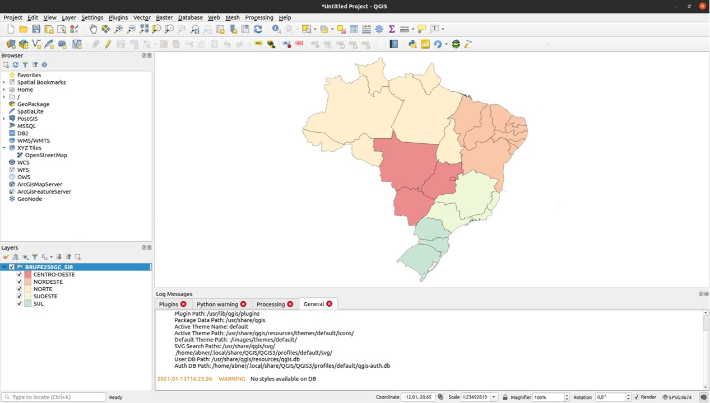
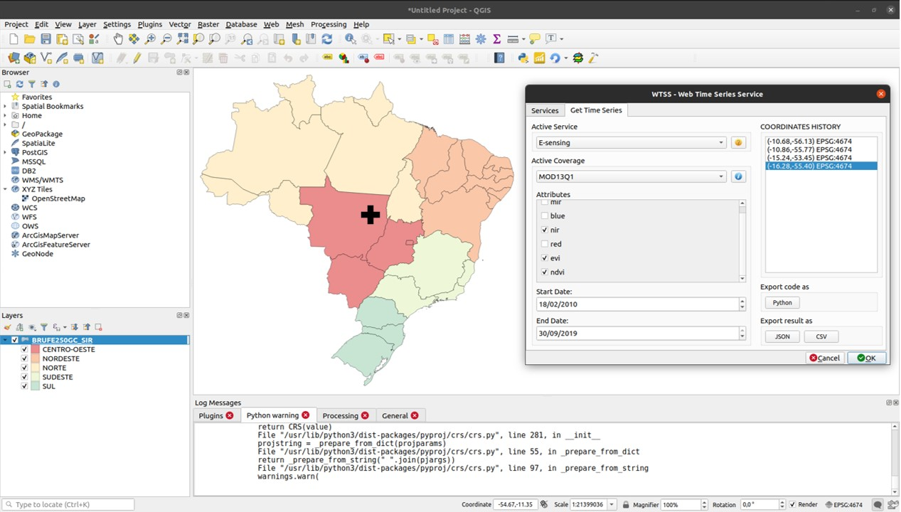
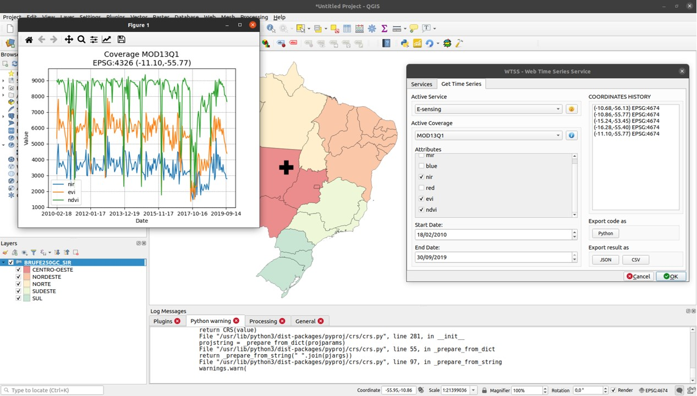

..
    This file is part of Python QGIS Plugin for WTSS.
    Copyright (C) 2024 INPE.

    This program is free software: you can redistribute it and/or modify
    it under the terms of the GNU General Public License as published by
    the Free Software Foundation, either version 3 of the License, or
    (at your option) any later version.

    This program is distributed in the hope that it will be useful,
    but WITHOUT ANY WARRANTY; without even the implied warranty of
    MERCHANTABILITY or FITNESS FOR A PARTICULAR PURPOSE. See the
    GNU General Public License for more details.

    You should have received a copy of the GNU General Public License
    along with this program. If not, see <https://www.gnu.org/licenses/gpl-3.0.html>.

Usage
*****

Enable WTSS-QGIS Plugin
+++++++++++++++++++++++

Open QGIS Desktop and add a vector layer as the figure below:

Go to ``Plugins`` tab in ``Management Plugins`` option to verify if WTSS-QGIS is enable. You will find the follow information such a figure below:

.. image:: ./assets/screenshots/step2.jpg
    :width: 100%
    :alt: Enable WTSS-PLUGIN

Run WTSS-QGIS Plugin
++++++++++++++++++++

You can open the WTSS-QGIS Plugin in ``Web`` tab. The following screen will appear:

You must select an active ``WTSS server`` that you want to use. And choose the parameters for active ``coverages`` to retrieve the time series information. You must select the available ``bands`` and set a ``start`` and ``end date`` for coverage filter. Finally click on map to get a ``latitude`` and ``longitude`` in vector layer with mouse.

After that, ``Time Series Chart`` will be displayed in new screen with the selected parameters, such a figure:

