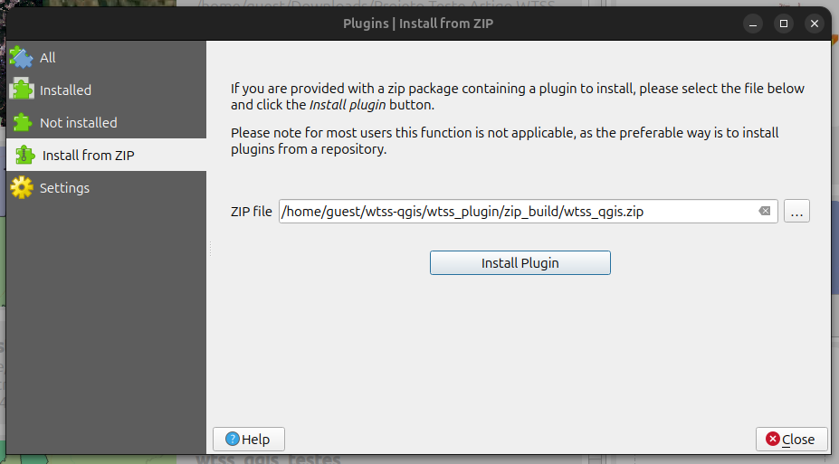
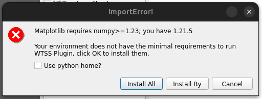

..
    This file is part of Python QGIS Plugin for WTSS.
    Copyright (C) 2024 INPE.

    This program is free software: you can redistribute it and/or modify
    it under the terms of the GNU General Public License as published by
    the Free Software Foundation, either version 3 of the License, or
    (at your option) any later version.

    This program is distributed in the hope that it will be useful,
    but WITHOUT ANY WARRANTY; without even the implied warranty of
    MERCHANTABILITY or FITNESS FOR A PARTICULAR PURPOSE. See the
    GNU General Public License for more details.

    You should have received a copy of the GNU General Public License
    along with this program. If not, see <https://www.gnu.org/licenses/gpl-3.0.html>.

=================
User Installation
=================

The first step for commom users to install the plugin is download the latest release of zip file from `https://github.com/brazil-data-cube/wtss-qgis/releases <https://github.com/brazil-data-cube/wtss-qgis/releases>`_.

Using `Install from ZIP` option
-------------------------------

After download the `zip` file, start your QGIS and go to ``Plugins >> Manage and Install Plugins`` and install the plugin via zip by selecting the file and clicking in ``Install Plugin``.

Follow the installation guide to configure python dependencies, note that you can choose (using the checkbox to enable the use of Python Home) install dependencies directly in ``Python Home`` (not recommended) or localy using the ``Plugin Path``.

The users can choose install dependencies ``all in one time`` (Install All) or ``one by one`` (Install By), the last option is recommended when the user has any of plugin dependencies `setup.py <https://github.com/brazil-data-cube/wtss-qgis/blob/8767a8ae6e29ad5c115ac8f8d66b7034f857c6c3/setup.py#L60>`_ already installed in your environment.

This window will run the ``pip install`` command using a subprocess. After this step, this window will request the user to reload the QGIS instance.

Using Terminal or OSGEO Shell
-----------------------------

To install plugin using the terminal for Linux users, just open the terminal and check the python version as explained in `FAQ <./faq.html>`_.

For Windows users you need to start the `OSGeo4W Shell Software <https://www.osgeo.org/projects/osgeo4w/>`_ to run these commands.

The first step is to extract the files of downloaded zip file in QGIS plugins path, generally in `C:\Users\%USER%\AppData\Roaming\QGIS\QGIS%QGIS_VERSION%\profiles\default\python\plugins` for Windows and ` /home/${USER}/.local/share/QGIS/QGIS3/profiles/default/python/plugins` for Linux.

In this path, something like ``<...> profiles\default\python\plugins\wtss_plugin``, run:

.. code-block:: python

    pip install -r requirements.txt

.. note::

    After installation may occur some dependencies conflicts with python, there are some tips if this is the case in `Frequently Asked Questions <./faq.html>`_. But you can contact the team with BDC Team E-mail (`bdc.team@inpe.br <mailto:bdc.team@inpe.br>`_).

    After reload the QGIS environment go to ``Plugins >> Manage and Install Plugins`` and enable the ``WTSS``.

    .. image:: ./assets/screenshots/enable_plugin.png
        :width: 100%
        :alt: Enable Plugin
